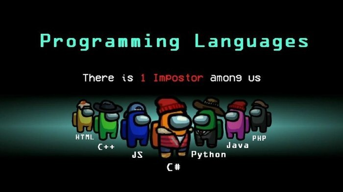

Jose Soto										   	
02/24/2021												
CISC 3140-MW2
Lab 3

I've got a copy of a Chase job posting for Software Engineer attached in this folder, and they are pretty clear at least in many points on what exactly they are looking for.  I want to start looking at the qualifications they have listed bit-by-bit to see what they are looking for, what I currently lack in that department(if anything) and what I can do to improve in that regard.

* 2+ years experience with front end development experience with JavaScript, HTML5, CSS3, Rest web services  
* Good understanding of AngularJS, React, NodeJS

These 2 points are pretty related so going over them together.  So 2+ years in experience means either looking for that much time in a previous job, education(like the CISC 3610 class I'm taking now) or other experience like freelance work or projects done on the side.  I wouldn't meet this criteria right now, but as mentioned I'm taking CISC 3610 which is exposing me to HTML5 and JavaScript so far so that'd be 4 months of experience I could claim.  After that I could work on building websites for practice on my own time.  The second point references 3 Javascript frameworks, which again I don't have personal experience with but I know they impact how an application ends up being designed.  But in getting a "good understanding" of the 3 libraries along with JS and HTML5 over time I could prove competency in the material, and have a portfolio of sites I've built to demonstrate it.

* Proficiency in one or more modern programming languages 

Kind of vague here but essentially just need to show that you understand a modern programming language, so nothing older like C even though it's still used in things like the Linux Kernel still.

A lot of people like to joke that HTML/Java aren't real programming languages but thankfully that's not really applicable here since they have a separate requirement for those in qualifications, so really it's them trying to find out what OTHER languages they want you to know. So far I'm probably the most proficient in Java from all the classes that use it in Brooklyn College, although I have been teaching myself Python on the side whenever time allows.  So really it's again about trying to prove proficiency.  I could do this by linking past projects I've done and have hosted on a repository like GitHub, as well as showing my ability to understand others code by contributing to other projects hosted on GitHub using Pull Requests.  Some combination of the 2 over time should be sufficient in showing proficiency.

* Knowledge of industry-wide technology trends and best practices  
* Ability to work in large, collaborative teams to achieve organizational goal
* Understanding of software skills such as business analysis, development, maintenance, and software improvement  
* Advanced knowledge of application, data, and infrastructure architecture disciplines  

The first 2 of these points are things we are essentially learning in classes like this one and Intro. to Software Engineering.  On top of the course itself, when it comes to industry-wide trends and best practices and the other 3 points, that's where conference talks come in helpful.  Using [the International Conference on Software Engineering](https://2020.icse-conferences.org/) as an example, they themselves advertise themselves as *the premier software engineering conference, providing a forum for researchers, practitioners and educators to present and discuss the most recent innovations, research, experiences, trends and concerns in the field of Software engineering*.  So conferences such as this one have large groups of professionals coming together to talk about a wide range of subject matters.  The convenient part about any that occurred in 2020 is that due to the pandemic they were all recorded and throw up on YouTube, so it's easier to find specific talking points.  

This point can also be covered with tech podcasts and blog posts.  Many of the professionals who give these conference talks sometimes also have a blog they maintain with articles and/or podcasts they participate in.  One good blog post that gives some insight into a large companies recruiting process is [this one by Emma Bostian](https://compiled.blog/blog/i-passed-the-google-technical-interviews-you-can-too).  While Google's requirements for engineers are probably some of the most aggressive in the industry, just from reading this blog post I can get some information that companies will find important for Software Engineers; data structures and algorithms.  She states the take-home coding project was only required because she was applying for UX Engineering role instead of Software Engineering, but she goes over in detail what they are looking for in each topic.  This helps the previous point on proficiency in modern programming languages as it will help you in the technical interview process, as it's information from someone successful in the field that has gone through the process many times.

* Passionate about building an innovative culture  

This is more of a personal thing, but you just need to be receptive to criticism and be willing to work with a team while embracing documentation.  At the end of the day no major software project is done solely by 1 person.  Major pieces of open source projects may have 1 maintainer who is in charge of everything and has the final say on pull requests, but they are dealing with multiple submissions sent by many different people on a constant basis.  We've all heard the stories of situations where a mission-critical project in a business is maintained by 1 person(like the 1 random person in Nebraska as you referenced in a lecture slide) and it's usually a recipe for disaster.  