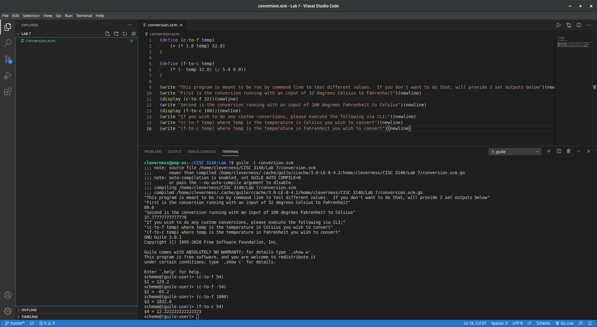
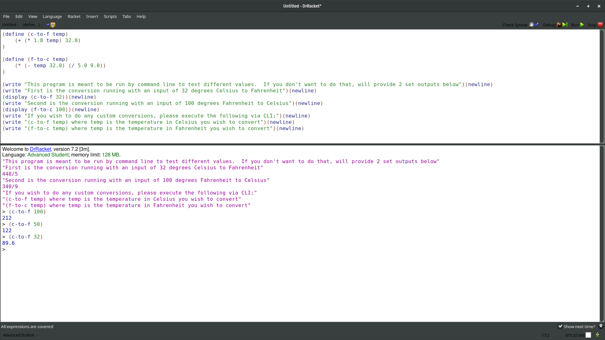

### Jose Soto, CISC3140-MW2 Spring 2021 [Lab 7 Assignment](https://docs.google.com/document/d/1qRxEH_pbgJOBe4m5O4RHH7MhR-8wyuhur7GPTJx4YA0/edit)

# Scheme Introduction

This lab involved writing a basic program in Scheme and then writing out how to get to the solution.

## Temperature Conversion

I did temperature conversion since it was one of the programming ideas provided, and it does enough to at least get us using what we learned so far involving evaluations, functions and displaying data.   First before writing out the scheme I needed to reference the actual formulas for conversion.

(C × 9/5) + 32 = F 

gives us Celsius to Fahrenheit, while

(F − 32) × 5/9 = C

gives us Fahrenheit to Celsius.  So first I wanted to create a function for each formula that can be called later.  Starting with the first formula, I entered up with the following function;

```
(define (c-to-f temp)
    (+ (* 1.8 temp) 32.0)
)
```

Since I need to explain it, let's just break it down line by line.  First line defines a function I call c-to-f that utilizes a variable called temp, which is where I will be placing by values when calling this function later.  Line 2 is essentially the Prefix notation form of the first formula referenced above. Looking at is

(**+** ~~(* 1.8 temp)~~ **32.0**)

*Trying to bold/italicize in markdown with a * function in the line is a little annoying, so the first part of that formula will be referenced by the strike-through portion.* 
 
 So we want this to be evaluated the same way the Celsius formula that gets done, which means (C × 9/5) is done first, so we write this out in prefix notation as such since the innermost parenthesis gets done first.  Also to avoid fractions as an answer in the CLI I just converted 9/5 to 1.8, otherwise that's how the final calculation would be outputted.   

Using the pre-chosen value I picked in my program of 32 C as a test, this portion yields us a value of 57.6 so far.  Now the computer sees the line as
 
(**+** ~~57.6~~ **32.0**)

The strike-through parenthesis has been evaluated and we are just left with a simple prefix addition, which yields a value of 89.6.  Doing the same breakdown for Fahrenheit to Celsius we got the following function

```
(define (f-to-c temp)
    (* (- temp 32.0) (/ 5.0 9.0))
)
```
First line defines a function I call f-to-c that utilizes a variable called temp, very similar to the definition of the other function.  Breaking down how I wanted the computer to calculate this in prefix I ended up with 

(* ~~(- temp 32.0)~~ **(/ 5.0 9.0)**)

This time we ended up with 2 innermost parenthesis(represented by strike-through and bold) that need evaluating because 5/9 doesn't divide down into a nice small number like 9/5 did to 1.8, so to be as accurate as possible we are doing the division in line.  The Fahrenheit temperature I used to demo the function is 100 F, so if we look at the strike-through evaluation first we see it breaks down to (temp - 32) in notation we are used to, similar to the (F − 32) part of the formula that gets done first.  Then the other innermost parenthesis(which is technically at the same 'depth' as the first one so in this case it doesn't really matter which is done first, but i'm assuming the computer works like I do and goes from left-to-right) does a simple division of 5/9.  After performing that step the computer should see something like the line below

(* ~~68~~ *0.555555556*) 

which in this case just now becomes a simple multiplication evaluation which gives us 37.777777778 for our Celsius value.

## Testing the Functions

So I added the following write statements to first show 2 sample outputs I chose while testing the program to make sure it works while referencing other calculators to verify, and then gave instructions how to call the functions via CLI to convert any values you want.

```
(write "This program is meant to be run by command line to test different values.  If you don't want to do that, will provide 2 set outputs below")(newline)
(write "First is the conversion running with an input of 32 degrees Celsius to Fahrenheit")(newline)
(display (c-to-f 32))(newline)
(write "Second is the conversion running with an input of 100 degrees Fahrenheit to Celsius")(newline)
(display (f-to-c 100))(newline)
(write "If you wish to do any custom conversions, please execute the following via CLI;")(newline)
(write "(c-to-f temp) where temp is the temperature in Celsius you wish to convert")(newline)
(write "(f-to-c temp) where temp is the temperature in Fahrenheit you wish to convert")(newline)
```

Below you can see what it looks like when you open guile while asking it to load the file(which I called conversion.scm) with the **-l** option.



It prints all my write messages, then the GNU Guile copyright and them puts you in the guile terminal where you can clal the functions referenced above.  I did 4 just to show the syntax.

One thing I noticed while testing the code in other platforms is that when checking it in DrRacket, anything I processed and displayed before the terminal appears isn't rounded down to a decimal like it should be.  When calling the function with the same values again, it outputted as intended, so I'm not sure what part of DrRacket causes this behavior to happen before the terminal appears.  I looked around briefly in the settings to see but nothing jumped out right away, but just noting it since it's something that came up during testing.



