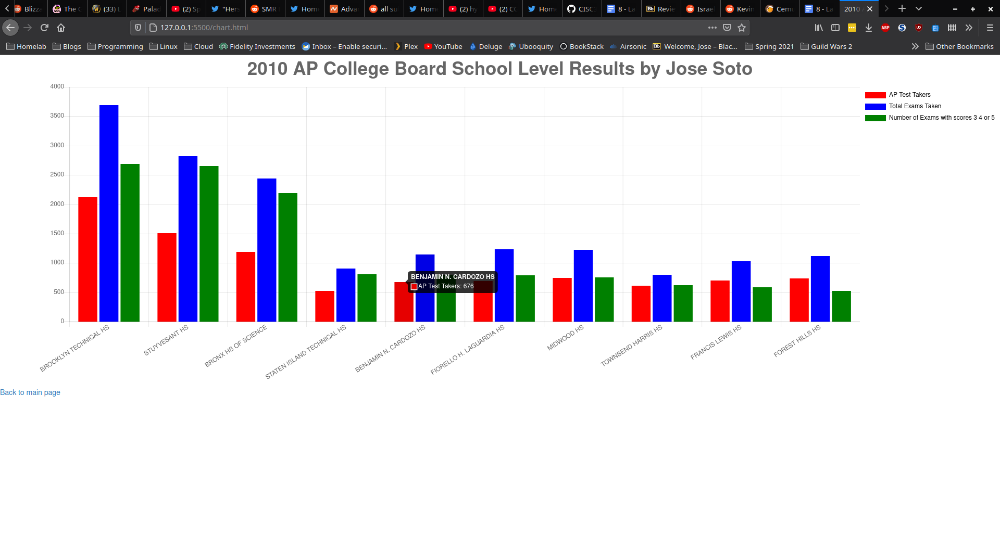

### Jose Soto, CISC3140-MW2 Spring 2021 [Lab 8 Assignment](https://docs.google.com/document/d/1QEY7TIOFiuRjIoyuFgMYE39ZiS-jy-76c57QMyDIHfc/edit)

# Problem

Wanted to visualize data from a csv file using chart.js.

## CSV File

The CSV file provided has a list of all the NYC High Schools 2010 AP data; how many students took the exam, how many exams were taken(since a student can potentially take multiple) and the pass rates.  To make it easier to chart I sorted by the 10 largest schools in terms of number of students who took exams.

## Using Chart.js

While you can download it locally, chart gives you the option to call the javascript file remotely, so I didn't need to actually include any dependencies to get this to run on any machine, as long as an internet connection is available.  What came after was deciding what type of chart to use, which varies depending on the data you have available and how you want it represented.

As you can see pictured above, I decided to go with a regular bar chart.  Due to the 3 main data points I was looking to track(# of AP Test Takers, Total Exams Taken, and Number of Exams with scores of 3 4 5) having then right next to each other like this accurately shows the data while also letting one draw their own conclusions from it.  

Like the 3 specialized High Schools are at the top, and while Brooklyn Tech has the most amount of tests taken compared to Stuyvesant, they only had 39 more passing grades in comparison to Stuyvesant despite taken 843 more exams.