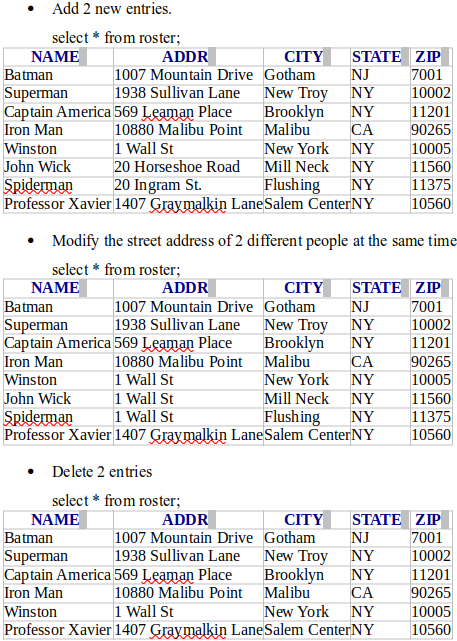
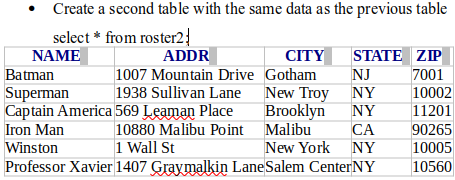
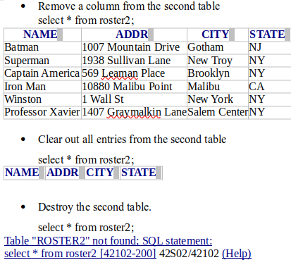

### Jose Soto, CISC3140-MW2 Spring 2021 [https://docs.google.com/document/d/1IZ3nez1eLg1Psx_f8xN7NvQWkBqU5hiYJnPk3GDOWeo/edit)

# Problem

If you are already comfortable working with databases, pick a mini-project where you’ll be working on a database.
Write a reflection that explains why you are working on that problem, and why you chose that particular database. Also describe what you learned.

## SQL queries

All queries were run through H2 Database engine.  It's free, runs off a java file downloaded and run locally and makes it easy to test queries without going through the hassle of setting up and connecting to a database.

```
create table roster(name varchar(30), addr varchar(30), city varchar(20), state char(2), zip int); //creates roster table with name, address, city and state column

insert into roster values('Batman', '1007 Mountain Drive', 'Gotham', 'NJ', 07001); //insert 5 random entries into the 
insert into roster values('Superman', '1938 Sullivan Lane', 'New Troy', 'NY', 10002);
insert into roster values('Captain America', '569 Leaman Place', 'Brooklyn', 'NY', 11201);
insert into roster values('Iron Man', '10880 Malibu Point', 'Malibu', 'CA', 90265);
insert into roster values('Winston', '1 Wall St', 'New York', 'NY', 10005);
insert into roster values('John Wick', '20 Horseshoe Road', 'Mill Neck', 'NY', 11560);
show columns from roster; //tables layout

//add 2 new entries
insert into roster values('Spiderman', '20 Ingram St.', 'Flushing', 'NY', 11375);
insert into roster values('Professor Xavier', '1407 Graymalkin Lane', 'Salem Center', 'NY', 10560);
select * from roster;

//Modify the street address of 2 different people at the same time.  John Wick and Spiderman go to the Continental.
update roster set addr = '1 Wall St' where name IN ('Spiderman', 'John Wick');
select * from roster;

//Delete 2 entries,
delete from roster where name IN('Spiderman', 'John Wick');
select * from roster;

//Create a second table with the same data as the previous table

create table roster2 as (select * from roster);
select * from roster2;

//Remove a column from the second table

alter table roster2 drop zip;
select * from roster2;

//Clear out all entries from the second table.

delete from roster2;
select * from roster2;

//Destroy the second table.

drop table roster2;
select * from roster2;
```

## Output from queries





## Reflection

My small project was to try and create and manipulate tables in a database.  The reason I did this was because I eventually hope to do something similar in my ongoing 4900 project in building a network.  Adding a database server that stores important information(like employee data) that another program could pull for doing anything like payroll, HR tasks like hiring and background checks, etc.  When it comes to big data, while they can be exported or imported using csv files you still want the bulk of the actual processing to be done using a database like MySQL, PostgreSQL, MongoDB, etc that can leverage computer hardware more efficiently than programs like Excel for computing. 